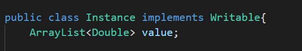
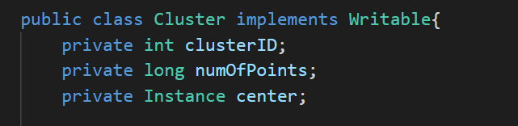
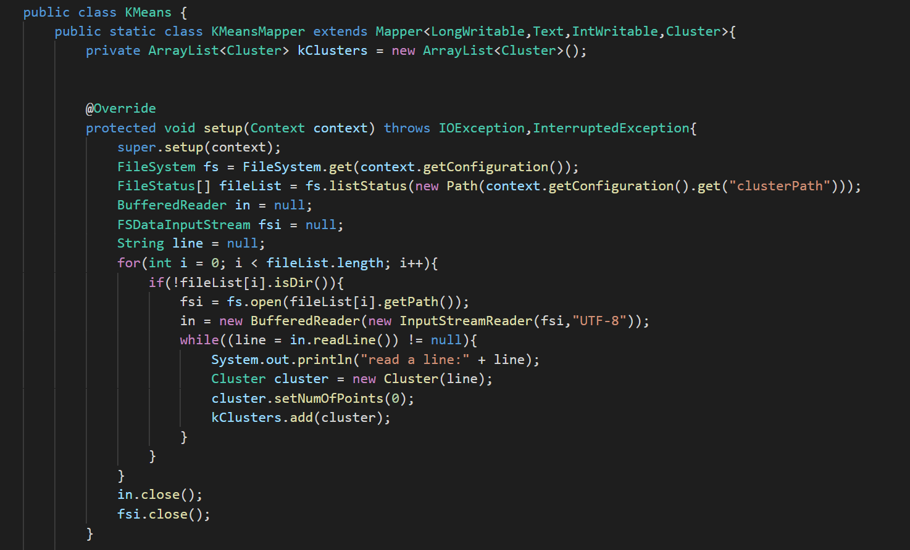
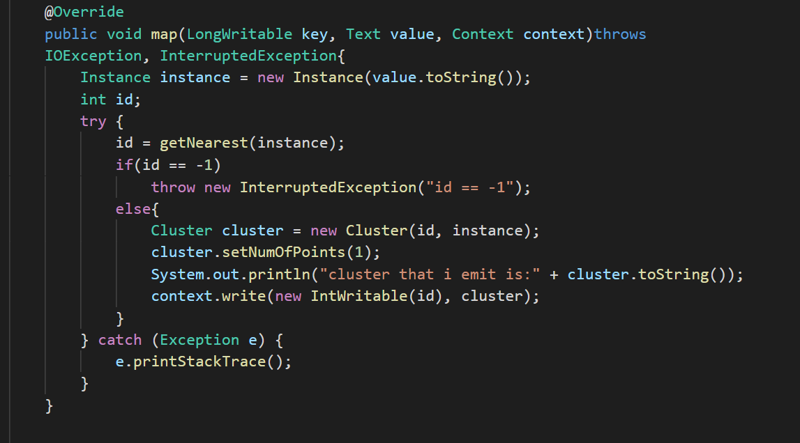
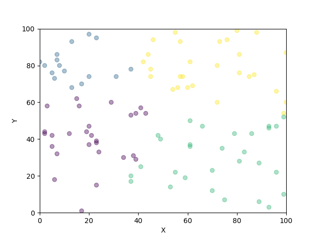

# 金融大数据 作业7
####  吴泓宇 181250155

## 设计思路

本次实验的代码我借鉴了课本中的参考实现，同时针对作业的具体要求做出了修改，项目目录如下：

其中各文件的功能分别为：

|文件名|功能|
|:-:|:-:|
|`Utils/Distance.java`|定义计算距离的接口|
|`Utils/EuclideanDistance.java`|计算欧氏距离
|`Cluster.java`|定义簇中心类
|`Instance.java`|定义输入数据类
|`Kmeans.java`|实现Kmeans的迭代的类
|`KmeansCluster.java`|输出最终结果的类
|`KMeansDriver.java`|程序入口
|`RandomClusterGenerator.java`|随机选取中心类
|`plot.py`|可视化画图类
|`setup.sh`|自动化执行任务的脚本

具体实现如下

输入数据类：是一个向量，维度可扩展

簇中心类，包括id，当前归属点数，和中心坐标

`Kmeans`类，setup读取输入文件，即上一次迭代产生的簇中心文件

`map` 输出数据的格式为 <id,instance>

`Combiner`，先将各个`mapper`的数据取平均值

`Reducer`，在进行一次取均值

`KmeansCluster`的`mapper`，与之前类似，但此处我为了输出文件格式易于处理将所有输出都绑定在`Key`上，value部分使用了`NullWritable`。

程序核心流程，执行`interationNum`次mapreduce，并将每次迭代的结果都以文件的形式存储下来，以提供给下一次迭代读取

计算欧氏距离的类

作图脚本，由于java本身作图远不如python方便，其做出的图像也不如python美观(jfreechart)，因此我选择写一个小脚本来进行可视化

那么现在我们需要同时运行java和python程序，在尝试在java内部调用python之后，效果不太理想，因此我想到了再写一个shell脚本的方法，这样不仅可以解决两个程序自动化运行的问题，还顺便把繁琐的清理目录，host目录，以及更换K和Iteration num的流程都自动化了，这样我在Bash输入一行命令之后就可以放心离开等结果就好。

## 实验结果 

k = 2, iter = 2

k = 2, iter = 5

k = 2, iter = 10

k = 3, iter = 2

k = 3, iter = 5

k = 3, iter = 10

k = 4, iter = 2

k = 4, iter = 5

k = 4, iter = 10

......

--------------------------------

我用脚本一共做到了k=2~10的实验，迭代次数分别为2，5，10，全部结果可以在本目录下的`figure`目录查看

可以得到以下结论：

- 本次实验数据分布非常随机，可以看出几乎均匀杂乱地分布在坐标系内
- 由于上述特征，Kmeans算法并没有取得很好的效果，迭代次数并不会显著影响结果，反而是最初的选取的簇中心的值几乎决定了最终分类结果的大致情况

Web页面截图

## 总结

本次实验主要是回顾上课讲的Kmeans算法的思想和基本流程，但由于提供的数据本身缺少聚类的基础，最终没有得到满意的结果。不过通过这次实验我学会了一项重要的技能：shell脚本的编写，如果没有shell，我将在电脑前一步步地等待程序运行，调参数，清理目录，再次运行。。。如此循环，然而通过几行shell代码，这些操作就能轻松地自动化运行，并将结果整齐地存放起来，这还是很有成就感的！